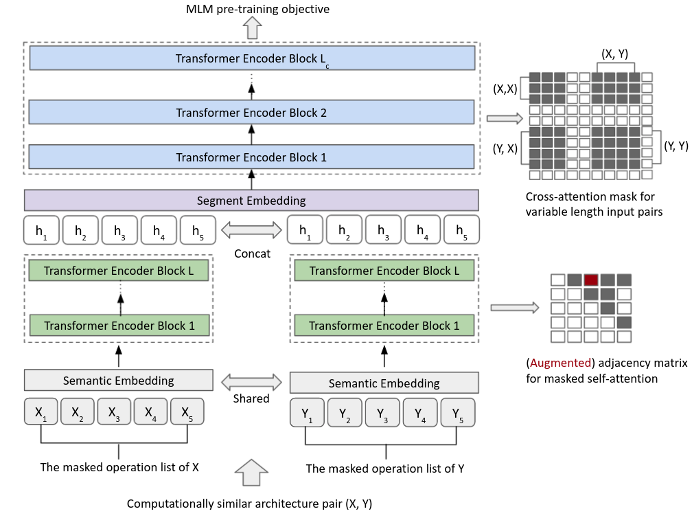

 # CATE: Computation-aware Neural Architecture Encoding with Transformers
Code for paper:
> [CATE: Computation-aware Neural Architecture Encoding with Transformers](https://arxiv.org/abs/2102.07108) \
> Shen Yan, Kaiqiang Song, Fei Liu, Mi Zhang. \
> _ICML 2021_.

<p align="center">
   <br />
  <b> Overview of CATE: </b>  It takes computationally similar architecture pairs as the input and trained to predict masked operators given the pairwise computation information. Apart from the cross-attention blocks, the pretrained Transformer encoder is used to extract architecture encodings for the downstream search.
</p>

The repository is built upon [pybnn](https://github.com/automl/pybnn) and [nas-encodings](https://github.com/naszilla/nas-encodings). 

## Requirements
```bash
conda create -n tf python=3.7
source activate tf
cat requirements.txt | xargs -n 1 -L 1 pip install
```

## Experiments on NAS-Bench-101 
### Dataset preparation on NAS-Bench-101

Install [nasbench](https://github.com/google-research/nasbench) and download [nasbench_only108.tfrecord](https://storage.googleapis.com/nasbench/nasbench_only108.tfrecord) in `./data` folder.

```bash
python preprocessing/gen_json.py
```

Data will be saved in `./data/nasbench101.json`.

### Generate architecture pairs
```bash
python preprocessing/data_generate.py --dataset nasbench101 --flag extract_seq
python preprocessing/data_generate.py --dataset nasbench101 --flag build_pair --k 2 --d 2000000 --metric params
```
The corresponding training data and pairs will be saved in `./data/nasbench101/`.

Alternatively, you can download the data `train_data.pt`, `test_data.pt` and pair indices `train_pair_k2_d2000000_metric_params.pt`, `test_pair_k2_d2000000_metric_params.pt` from [here](https://drive.google.com/drive/folders/1jGgScJRCWyRvIYuLp60U1XpjiF-hAMsl).

### Pretraining
```bash
bash run_scripts/pretrain_nasbench101.sh
```

The pretrained models will be saved in `./model/`.


Alternatively, you can download the pretrained model `nasbench101_model_best.pth` from [here](https://drive.google.com/drive/folders/1jGgScJRCWyRvIYuLp60U1XpjiF-hAMsl).

### Extract the pretrained encodings
```bash
python inference/inference.py --pretrained_path model/nasbench101_model_best.pth.tar --train_data data/nasbench101/train_data.pt --valid_data data/nasbench101/test_data.pt --dataset nasbench101
```

The extracted embeddings will be saved in `./cate_nasbench101.pt`.

Alternatively, you can download the pretrained embeddings `cate_nasbench101.pt` from [here](https://drive.google.com/drive/folders/1jGgScJRCWyRvIYuLp60U1XpjiF-hAMsl).

### Run search experiments on NAS-Bench-101
```bash
bash run_scripts/run_search_nasbench101.sh
```

Search results will be saved in `./nasbench101/`.


## Experiments on NAS-Bench-301

### Dataset preparation
Install [nasbench301](https://github.com/automl/nasbench301) and download the `xgb_v1.0` and `lgb_runtime_v1.0` file. You may need to make [pytorch_geometric](https://github.com/rusty1s/pytorch_geometric) compatible with Pytorch and CUDA version.
```bash
python preprocessing/gen_json_darts.py # randomly sample 1,000,000 archs
```
Data will be saved in `./data/nasbench301_proxy.json`.

Alternatively, you can download the json file `nasbench301_proxy.json` from [here](https://drive.google.com/drive/folders/1SnTGaORrCWsWRomY8ioyK_q9KIYbLiq7).


### Generate architecture pairs
```bash
python preprocessing/data_generate.py --dataset nasbench301 --flag extract_seq
python preprocessing/data_generate.py --dataset nasbench301 --flag build_pair --k 1 --d 5000000 --metric flops
```
The correspoding training data and pairs will be saved in `./data/nasbench301/`.

Alternatively, you can download the data `train_data.pt`, `test_data.pt` and pair indices `train_pair_k1_d5000000_metric_flops.pt`, `test_pair_k1_d5000000_metric_flops.pt` from [here](https://drive.google.com/drive/folders/1SnTGaORrCWsWRomY8ioyK_q9KIYbLiq7).


### Pretraining
```bash
bash run_scripts/pretrain_nasbench301.sh
```

The pretrained models will be saved in `./model/`.

Alternatively, you can download the pretrained model `nasbench301_model_best.pth` from [here](https://drive.google.com/drive/folders/1SnTGaORrCWsWRomY8ioyK_q9KIYbLiq7).


### Extract the pretrained encodings
```bash
python inference/inference.py --pretrained_path model/nasbench301_model_best.pth.tar --train_data data/nasbench301/train_data.pt --valid_data data/nasbench301/test_data.pt --dataset nasbench301 --n_vocab 11
```

The extracted encodings will be saved in `./cate_nasbench301.pt`.

Alternatively, you can download the pretrained embeddings `cate_nasbench301.pt` from [here](https://drive.google.com/drive/folders/1SnTGaORrCWsWRomY8ioyK_q9KIYbLiq7).


### Run search experiments on NAS-Bench-301
```bash
bash run_scripts/run_search_nasbench301.sh
```

Search results will be saved in `./nasbench301/`.

## DARTS experiments without surrogate models
Download the pretrained embeddings `cate_darts.pt` from [here](https://drive.google.com/drive/folders/1T8LZt0zyJweeA7RRdxguOAjVxm4jsEwX).

```bash
python search_methods/dngo_ls_darts.py --dim 64 --init_size 16 --topk 5 --dataset darts --output_path bo  --embedding_path cate_darts.pt
```
Search log will be saved in `./darts/`. Final search result will be saved in `./darts/bo/dim64`.

### Evaluate the learned cell on DARTS Search Space on CIFAR-10
```bash
python darts/cnn/train.py --auxiliary --cutout --arch cate_small
python darts/cnn/train.py --auxiliary --cutout --arch cate_large
```
- Expected results (CATE-Small): 2.55\% avg. test error with 3.5M model params.
- Expected results (CATE-Large): 2.46\% avg. test error with 4.1M model params.

### Transfer learning on ImageNet
```bash
python darts/cnn/train_imagenet.py  --arch cate_small --seed 1 
python darts/cnn/train_imagenet.py  --arch cate_large --seed 1
```
- Expected results (CATE-Small): 26.05\% test error with 5.0M model params and 556M mult-adds.
- Expected results (CATE-Large): 25.01\% test error with 5.8M model params and 642M mult-adds.
### Visualize the learned cell
```bash
python darts/cnn/visualize.py cate_small
python darts/cnn/visualize.py cate_large
```
## Experiments on outside search space
### Build outside search space dataset
```bash
bash run_scripts/generate_oo.sh
```
Data will be saved in `./data/nasbench101_oo_train.json` and `./data/nasbench101_oo_test.json`.

### Generate architecture pairs
```bash
python preprocessing/data_generate_oo.py --flag extract_seq
python preprocessing/data_generate_oo.py --flag build_pair
```
The corresponding training data and pair indices will be saved in `./data/nasbench101/`.

### Pretraining
```bash
python run.py --do_train --parallel --train_data data/nasbench101/nasbench101_oo_trainSet_train.pt --train_pair data/nasbench101/oo_train_pairs_k2_params_dist2e6.pt  --valid_data data/nasbench101/nasbench101_oo_trainSet_validation.pt --valid_pair data/nasbench101/oo_validation_pairs_k2_params_dist2e6.pt --dataset oo
```

The pretrained models will be saved in `./model/`.

### Extract embeddings on outside search space
```bash
# Adjacency encoding
python inference/inference_adj.py
# CATE encoding
python inference/inference.py --pretrained_path model/oo_model_best.pth.tar --train_data data/nasbench101/nasbench101_oo_testSet_split1.pt --valid_data data/nasbench101/nasbench101_oo_testSet_split2.pt --dataset oo_nasbench101
```

The extracted encodings will be saved as `./adj_oo_nasbench101.pt` and `./cate_oo_nasbench101.pt`.

Alternatively, you can download the data, pair indices, pretrained models, and extracted embeddings from [here](https://drive.google.com/drive/folders/1cz9OwKyqGnChXMd4B89NoTM_EOvjIwrc).


### Run MLP predictor experiments on outside search space
```bash
for s in {1..500}; do python search_methods/oo_mlp.py --dim 27 --seed $s --init_size 16 --topk 5 --dataset oo_nasbench101 --output_path np_adj  --embedding_path adj_oo_nasbench101.pt; done
for s in {1..500}; do python search_methods/oo_mlp.py --dim 64 --seed $s --init_size 16 --topk 5 --dataset oo_nasbench101 --output_path np_cate  --embedding_path cate_oo_nasbench101.pt; done
```

Search results will be saved in `./oo_nasbench101`.

## Citation
If you find this useful for your work, please consider citing:
```
@InProceedings{yan2021cate,
  title = {CATE: Computation-aware Neural Architecture Encoding with Transformers},
  author = {Yan, Shen and Song, Kaiqiang and Liu, Fei and Zhang, Mi},
  booktitle = {ICML},
  year = {2021}
}
```